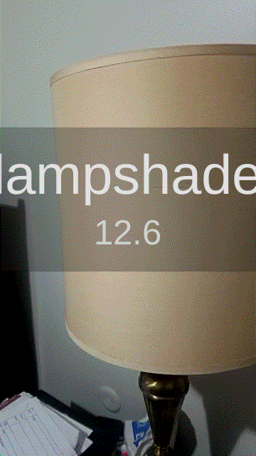

# Classifier Cam

This is an example project which integrates the NatML deep learning API with the NatDevice media device API for realtime object classification. The project currently includes the following models:
- [MobileNet v2](https://github.com/onnx/models/tree/master/vision/classification/mobilenet)
- [ShuffleNet v2](https://github.com/onnx/models/tree/master/vision/classification/shufflenet)
- [SqueezeNet 1.1](https://github.com/onnx/models/tree/master/vision/classification/squeezenet)

## Requirements
- Unity 2019.2+
- NatML 1.0+
- NatDevice 1.1+

## Supported Platforms
- Android API level 24+
- iOS 13+
- macOS 10.15+
- Windows 10 (64-bit)